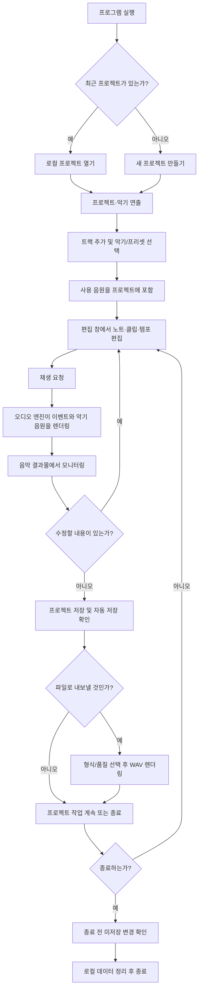
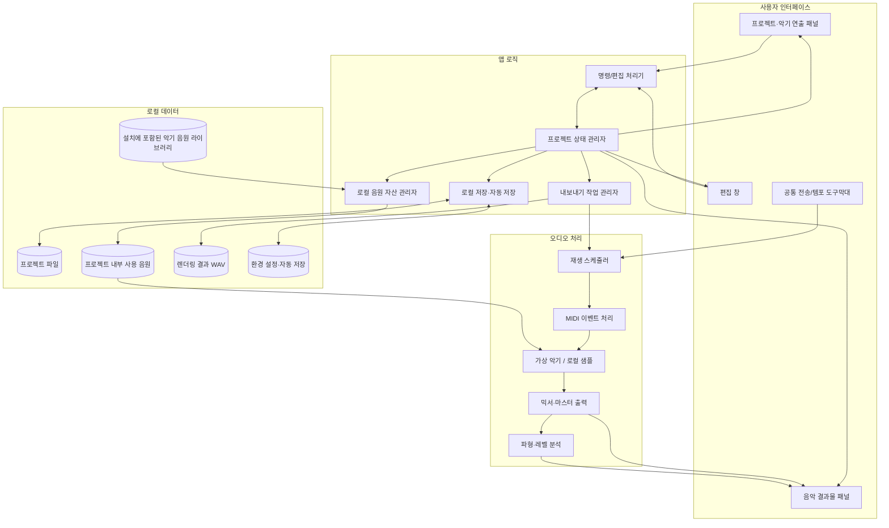

# 오프라인 1인용 음악 프로그램 설계 초안

## 전제와 핵심 구조

- 첫 배포 대상은 Windows 데스크톱 프로그램입니다. 브라우저나 로컬 웹 서버 없이 `.exe`로 실행합니다.
- 네트워크 연결 없이 실행하며 프로젝트, 악기 프리셋, 샘플, 자동 저장 데이터를 모두 로컬에서 관리합니다.
- 프로젝트는 형식 버전이 포함된 JSON 기반 `.mmproj` 파일로 저장합니다. 프로젝트 이름, 공통 조율값, 악기 종류·사용자 지정 이름·역할, 등록된 역할 목록, 악기 음표, 오디오 트랙의 시작 마디와 채널별 믹서 설정을 기록합니다.
- 화면은 **좌상단 프로젝트·악기 관리**, **우상단 작업 악기**, **하단 작업 결과·믹서**의 세 작업 영역으로 구성합니다.
- 악보 음표와 타임라인 WAV 오디오를 같은 재생에서 들을 수 있습니다. 악보 음표는 현재 기본 사인파 음색으로 출력하며, 악기별 실제 음색은 아직 연결하지 않았습니다.
- 실제 악기 음원과 기본 프리셋 라이브러리를 프로그램 설치 파일에 포함하는 것이 최종 목표입니다. 인터넷 연결이나 별도 음원 다운로드 없이 사용할 수 있어야 합니다.
- 사용자가 가져온 오디오 파일은 프로젝트 옆의 `<프로젝트이름>.Assets/Audio`에 복사하고, 프로젝트 파일에는 상대 경로를 기록합니다. 같은 음원은 내용 해시로 중복 저장하지 않습니다.
- MVP는 MIDI 기반 편집, 포함된 실제 악기 음원, WAV 내보내기를 우선합니다. 플러그인·고급 믹싱은 이후 확장 항목입니다.

## 파일 형식 정책

| 용도 | 지원 형식 | 범위와 상태 |
|---|---|---|
| 프로젝트 열기/저장 | `.mmproj` | 현재 구현됨. 내부 데이터는 버전이 있는 JSON이며, 일반 `.json` 파일은 프로젝트로 열지 않습니다. |
| 오디오 트랙 가져오기·재생 | `.wav` | 구현됨. PCM 16/24-bit 또는 IEEE float 32-bit, 모노/스테레오를 지원합니다. 여러 클립을 BPM 기준으로 시작 마디에 맞춰 믹싱하고 채널 볼륨·음소거·솔로를 반영합니다. 재생 위치는 마디 단위로 표시합니다. |
| 악보 편집·재생 | 프로젝트 내부 데이터 | 높은음자리표에 C4~B5 음표를 배치하고 선택·삭제, 올림표, 길이와 세기를 편집합니다. 음표 데이터는 기존 `.mmproj` 형식에 저장되며, BPM·트랙 음량·음표 세기를 반영해 기본 사인파로 재생하고 악보에 재생 위치를 표시합니다. 쉼표, 박자표, 조표, 내림표, 악기별 음색은 후속 작업입니다. |
| 외부 MIDI 가져오기 | `.mid`, `.midi` | 현재 미구현입니다. |
| 음악 결과 내보내기 | `.wav` | 아직 미구현입니다. |

초기 버전에서 직접 가져오지 않는 형식은 MP3, AAC/M4A, WMA, OGG, FLAC, AIFF, 동영상 파일, VST/VST3 플러그인, SoundFont(`.sf2`)입니다. 필요성이 확인되면 디코더나 신스 엔진 선택 후 별도 범위로 추가합니다. 파일 확장자만 바꾼 파일은 지원 형식으로 취급하지 않습니다.

WAV 경로는 `.mmproj` 안에 프로젝트 폴더 기준 상대 경로로 저장합니다. 프로젝트를 다른 위치로 옮기거나 공유할 때는 `.mmproj` 파일과 같은 이름의 `.Assets` 폴더를 함께 이동해야 오디오 트랙을 유지할 수 있습니다.

## 화면 구성도

```text
┌──────────────────────────────────────────────────────────────────────────────┐
│ MAKE MUSIC       프로젝트 이름                 [저장 상태] [재생] [정지] [템포] │
├──────────────────────────────┬───────────────────────────────────────────────┤
│ 1. 프로젝트·악기 관리         │ 2. 작업 악기 / 출력 미리보기                 │
│ 프로젝트·악기 추가/이름/역할  │ 선택 악기의 작업 상태                       │
│ 악기 종류와 사용자 지정 역할  │ 악기 출력·재생 상태                         │
├──────────────────────────────┼───────────────────────────────────────────────┤
│ 3. 전체 악기 믹서             │ 4. 작업 결과 타임라인                        │
│ 공통 조율·마스터 설정         │ 악기 트랙과 오디오 클립 타임라인             │
│ 악기/오디오 채널 볼륨·음소거·솔로│ 재생 위치·박자 눈금                        │
└──────────────────────────────┴───────────────────────────────────────────────┘
```

상단 왼쪽에서 프로젝트와 악기 구성을 관리하고, 상단 오른쪽에서 현재 작업 중인 악기를 확인합니다. 하단 오른쪽은 배치 타임라인과 악보 편집 탭으로 전환합니다. 악보 탭에서 음표를 입력하고 프로젝트에 저장합니다. 하단 왼쪽 믹서는 전체 악기와 오디오 채널을 관리합니다. 현재 악보 표시는 높은음자리표 단선율 입력을 시작하는 단계이며, 실제 악보 조판과 여러 성부 표현은 확장 작업입니다.

각 작업 패널의 제목을 드래그해 다른 패널 영역에 도킹할 수 있습니다. 이미 패널이 있는 영역에 놓으면 탭 그룹으로 합쳐지고, 기존 위치는 비워집니다. 패널 배치는 로컬 사용자 설정에 저장되어 다음 실행에도 복원됩니다. 기존 분할선은 패널 크기 조절에 사용합니다.

## 작업 흐름도



## 구성도



## 책임 경계와 오프라인 원칙

- **데스크톱 실행/배포:** Windows 창으로 실행하고 오디오 장치와 로컬 파일 시스템을 직접 사용합니다. 실행 파일은 설치 프로그램 또는 압축을 푼 포터블 폴더 형태로 배포하고, 기본 악기 음원 라이브러리도 함께 제공합니다. 프로젝트 파일은 실행 파일 폴더에 종속되지 않게 별도로 저장합니다.
- **프로젝트·악기 연출:** 트랙과 악기 구성, 프리셋, 파라미터를 관리합니다. 실제 악기 음원 라이브러리는 프로그램 설치에 포함해 첫 실행부터 오프라인으로 사용할 수 있게 합니다.
- **음악 결과물:** 재생 커서, 파형/레벨, 트랙별 모니터링과 출력 상태를 보여줍니다. 실제 소리는 오디오 엔진이 생성합니다.
- **편집 창:** 노트와 클립, 템포/박자, 벨로시티 및 오토메이션을 편집하고 프로젝트 상태 관리자에 변경 사항을 전달합니다.
- **프로젝트 상태 관리자:** 세 화면이 서로 다른 데이터를 보여주지 않도록 프로젝트의 단일 기준 상태를 유지합니다.
- **오디오 엔진:** UI와 분리된 실시간 처리 경로를 사용합니다. 오디오 콜백에서 디스크 접근이나 무거운 UI 작업을 하지 않습니다.
- **음원 자산 관리:** 설치 음원 라이브러리에서 프로젝트에 배정한 음원과 사용자가 가져온 음원을 프로젝트의 `Assets` 폴더로 복사합니다. 동일 파일은 프로젝트 안에서 중복 저장하지 않으며, 프로젝트를 다른 위치로 옮겨도 필요한 소리가 함께 이동합니다.
- **저장/내보내기:** 프로젝트, 포함된 음원, 자동 저장은 로컬 디스크에 기록합니다. 내보내기는 프로젝트 편집과 분리된 작업으로 WAV 파일을 생성합니다.
- **오프라인 보장:** 실행 중 네트워크 요청, 계정 로그인, 클라우드 동기화가 필요하지 않습니다. 파일 열기/내보내기는 사용자가 지정한 로컬 경로만 사용합니다.

## MVP 구현 순서

1. 새 프로젝트, 트랙 목록, 로컬 저장/열기 및 프로젝트별 `Assets` 폴더 — 구현됨
2. 높은음자리표 악보에서 음표를 입력·선택하고 길이·세기를 편집 — 초기 화면 구현 중
3. 입력한 악보를 템포에 맞춰 소리로 재생하고 재생 위치 표시
4. 쉼표, 박자표, 조표, 여러 성부 및 악보 읽기 편의 개선
5. 사용자가 입력한 설명을 음표 데이터로 바꾸는 AI 작곡 보조 — AI 실행 방식(온라인/로컬)과 범위를 정한 뒤 연결
6. WAV 내보내기, 자동 저장 및 종료 전 미저장 경고
